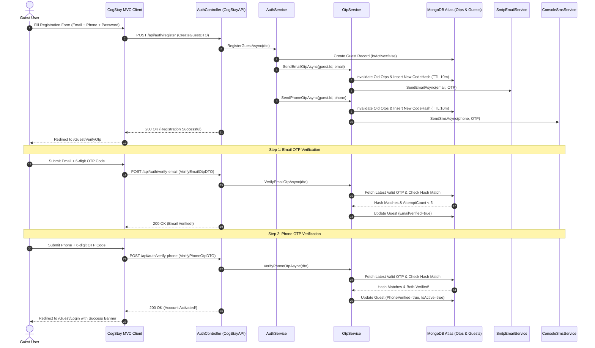

# CogStay: Dual OTP Verification Service Architecture & Workflow Guide

This document provides a comprehensive technical reference for the **Dual OTP Verification System (Email + Phone SMS)** implemented in **CogStay** (.NET 10.0 & MongoDB Atlas).

---

## 1. Overall OTP Architecture

The CogStay OTP verification architecture enforces **Dual-Factor Account Activation** before a guest can authenticate via JWT or access the system. Guest accounts are initialized with `IsActive = false`, `EmailVerified = false`, and `PhoneVerified = false` upon registration.

```
Guest Registration -> Generate 6-Digit Email OTP + Phone OTP
                     │
                     ├──> SHA-256 Hash -> Store in MongoDB `Otps` collection (CodeHash)
                     ├──> SmtpEmailService -> Send Email OTP
                     └──> ConsoleSmsService / Twilio -> Send SMS OTP
                     │
Verify Email OTP  ──> EmailVerified = true
Verify Phone OTP  ──> PhoneVerified = true
                     │
                     └──> (EmailVerified && PhoneVerified) => IsActive = true (Account Activated!)
```

---

## 2. Technical Component Specifications

| Layer / Component | File Location | Responsibility |
| :--- | :--- | :--- |
| **Domain Entity** | `CogStay.Domain/Entities/OtpRecord.cs` | BSON schema representing OTP records (`UserId`, `Target`, `OtpType`, `CodeHash`, `ExpiresAt`, `AttemptCount`, `LastSentAt`, `IsUsed`). |
| **Domain Enum** | `CogStay.Domain/Enums/OtpType.cs` | Defines verification channels (`Email = 1`, `Phone = 2`). |
| **Service Contract** | `CogStay.Application/Contracts/Services/IOtpService.cs` | Defines contracts for generating, verifying, and resending OTPs. |
| **Service Implementation**| `CogStay.Application/Services/OtpService.cs` | Contains cryptographic RNG generation, SHA-256 code hashing, 10-minute TTL validation, 5-attempt lockout, 60s cooldown, and activation logic. |
| **Persistence Repo** | `CogStay.Infrastructure/Repositories/OtpRepository.cs` | Manages MongoDB query operations and automated TTL index cleanup. |
| **Notification Services**| `CogStay.Infrastructure/Services/SmtpEmailService.cs`<br/>`CogStay.Infrastructure/Services/ConsoleSmsService.cs` | Dispatches HTML emails via SMTP/SendGrid and SMS payloads via Twilio/Console. |
| **API Controller** | `CogStayApi/Controllers/AuthController.cs` | Exposes REST endpoints (`/api/auth/register`, `/api/auth/verify-email`, `/api/auth/verify-phone`, `/api/auth/resend-otp`). |
| **MVC Controller** | `CogStay/Controllers/GuestController.cs` | Handles Razor UI forms, session state, and forwards verification calls. |

---

## 3. End-to-End Verification Sequence Diagram



---

## 4. Detailed Processing & Security Rules

### 1. Cryptographic OTP Code Generation
- Generated using .NET `System.Security.Cryptography.RandomNumberGenerator.GetInt32(100000, 999999)`.
- Generates non-deterministic, cryptographically secure 6-digit integer strings (e.g., `849201`).

### 2. SHA-256 Code Hashing (`CodeHash`)
- Plaintext 6-digit OTP codes are **never** stored in MongoDB or written to logs.
- The raw code is hashed via SHA-256 and stored as a Base64 string in `CodeHash`:
  $$\text{CodeHash} = \text{Base64}(\text{SHA256}(\text{UTF8}(\text{Code})))$$

### 3. Expiration & Rate-Limiting Controls
- **Expiration TTL**: Each OTP record has `ExpiresAt = DateTime.UtcNow.AddMinutes(10)`. MongoDB TTL index automatically purges expired records.
- **Attempt Limit Lockout**: Max 5 verification attempts permitted per OTP record. Upon 5 failed attempts, `IsUsed = true` is set, locking out further guesses and requiring a new OTP request.
- **Dispatch Cooldown**: A 60-second cooldown is enforced between resend requests (`LastSentAt.AddSeconds(60) > DateTime.UtcNow`).

---

## 5. API Endpoint Specifications

### `POST /api/auth/verify-email`
- **Request Body**:
  ```json
  {
    "email": "guest@example.com",
    "code": "849201"
  }
  ```
- **Success Response (200 OK)**:
  ```json
  {
    "success": true,
    "message": "Email verified successfully! Please verify your Phone OTP to activate your account.",
    "isAccountActivated": false
  }
  ```

### `POST /api/auth/verify-phone`
- **Request Body**:
  ```json
  {
    "phoneNumber": "+18005550199",
    "code": "392014"
  }
  ```
- **Success Response (200 OK)**:
  ```json
  {
    "success": true,
    "message": "Phone verified successfully! Both Email and Phone are now verified. Account activated.",
    "isAccountActivated": true
  }
  ```

### `POST /api/auth/resend-otp`
- **Request Body**:
  ```json
  {
    "target": "guest@example.com",
    "otpType": 1
  }
  ```
- **Response (200 OK)**:
  ```json
  {
    "message": "A new OTP has been dispatched successfully."
  }
  ```

---

## 6. Environment & Configuration Setup

Configure the following environment variables in production (`appsettings.json` or cloud settings):

```json
{
  "EMAIL_PROVIDER_HOST": "smtp.sendgrid.net",
  "EMAIL_PROVIDER_PORT": "587",
  "EMAIL_PROVIDER_USERNAME": "apikey",
  "EMAIL_PROVIDER_PASSWORD": "SG.your_sendgrid_api_key",
  "EMAIL_FROM": "no-reply@cogstay.com",
  "SMS_PROVIDER_API_KEY": "SK_twilio_or_telesign_key",
  "SMS_FROM": "+18005550199"
}
```

---

## 7. Troubleshooting Guide

| Issue / Symptom | Root Cause | Solution |
| :--- | :--- | :--- |
| **"Invalid or expired OTP"** | Code expired (>10 mins) or incorrect target | Check server UTC time alignment; request a new OTP code. |
| **"Please wait 60 seconds"** | Rapid resend request triggered within 60s | Wait for 60-second cooldown timer to elapse before retrying. |
| **"Maximum attempts exceeded"** | 5 incorrect verification attempts submitted | Request a new OTP via the Resend OTP button. |
| **"Guest account is not activated"** | User attempted login before verifying BOTH Email & Phone OTPs | Complete both Step 1 (Email) and Step 2 (Phone) on `/Guest/VerifyOtp`. |

