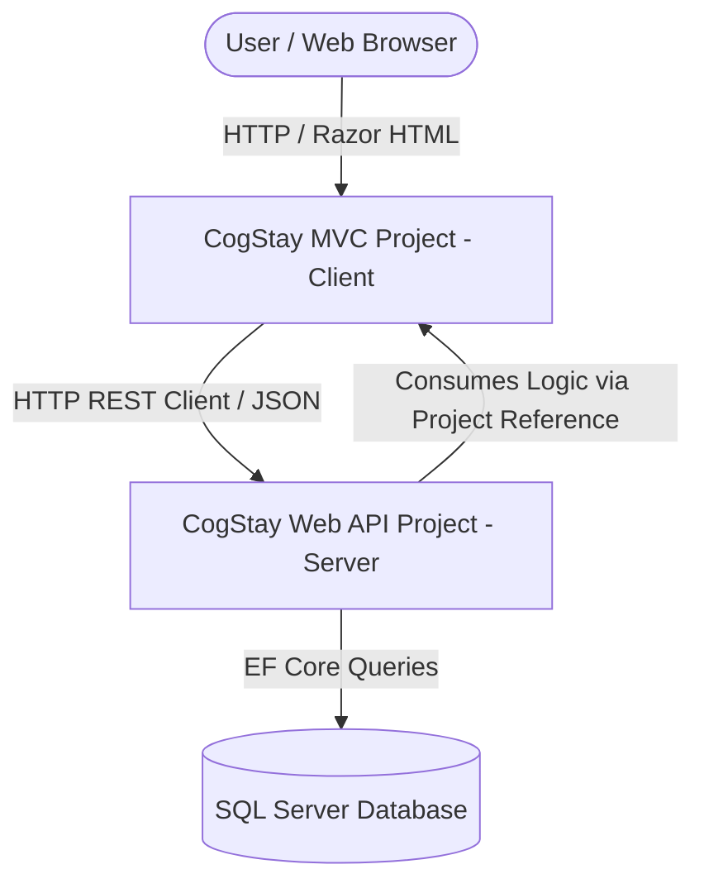
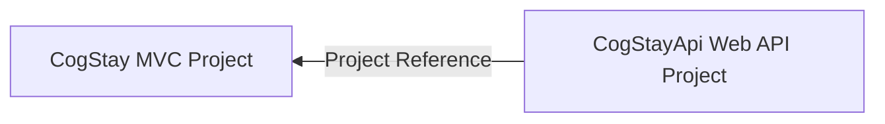

# System Architecture - CogStay Lodge Management System

This document outlines the decoupled architecture of the CogStay solution, showing how dependencies are organized and how components communicate.

---

## 1. Decoupled Client-Server Architecture

The system consists of two separate web applications running in independent processes, coordinated via HTTP:



* **Client Role (`CogStay`)**:
  Renders the graphical user interface. When an action occurs, the convention-based controller translates user inputs and executes stateless HTTP requests targeting the Web API.
* **Server Role (`CogStayApi`)**:
  Exposes REST endpoints. When a request arrives, the API controller resolves the business service directly from the referenced MVC assembly to perform database transactions, returning a serialized JSON result.

---

## 2. Project Reference & Dependency Relationships



* **Reference Direction**:
  Unlike standard N-tier configurations, the Web API project (`CogStayApi`) references the MVC project (`CogStay`).
* **Package Inheritance**:
  - `CogStay` registers EF Core and SQL Server tools directly.
  - `CogStayApi` references `CogStay` to utilize the compiled `HotelDbContext` and repository implementations at runtime.
* **Namespace Conformance**:
  Both projects share the root namespace `CogStayMVC`. This keeps code imports clean and compile-safe.

---

## 3. Detailed Request and Response Loop

Here is the trace of a single customer booking a room:

```text
User Browser              CogStay (MVC Client)          CogStayApi (Web API)               Database
    │                              │                             │                             │
    │─── [1] Book Room (POST) ────>│                             │                             │
    │    (CreateReservationDTO)    │                             │                             │
    │                              │─── [2] POST api/reserv ────>│                             │
    │                              │    (Json Serialization)     │                             │
    │                              │                             │── [3] Call BookRoomAsync ──>│
    │                              │                             │    (ReservationService)     │
    │                              │                             │                             │── [4] SaveChanges ─>
    │                              │                             │                             │   (HotelDbContext)
    │                              │                             │                             │<── [5] SQL Commit ──
    │                              │                             │<── [6] Return DTO Response ─│
    │                              │<── [7] HTTP 201 Response ───│                             │
    │                              │    (JSON Payload)           │                             │
    │<── [8] Render Success View ──│                             │                             │
```

1. **Client Interaction**: User fills the booking details and submits the form on the room booking page.
2. **MVC Action**: `GuestController.BookRoom(dto)` intercepts the request and issues a POST request to `api/reservations` on the API project via `HttpClient`.
3. **API Dispatch**: `ReservationApiController` receives the JSON payload, deserializes it to `CreateReservationDTO` (sourced from the MVC project reference), and executes `_reservationService.BookRoomAsync(dto)`.
4. **Logic Execution**: The `ReservationService` (housed in MVC) performs validation rules and delegates storage to the database context.
5. **Database Transaction**: The `ReservationRepository` (housed in MVC) persists the reservation in SQL Server.
6. **Return Pipeline**: The transaction completes, the database commits the row, and the API controller responds with a `201 Created` HTTP status containing the serialized `ReservationResponseDTO`.
7. **View Render**: The MVC client receives the response, sets a success message in `TempData`, and redirects the user to their dashboard showing the newly made reservation.
