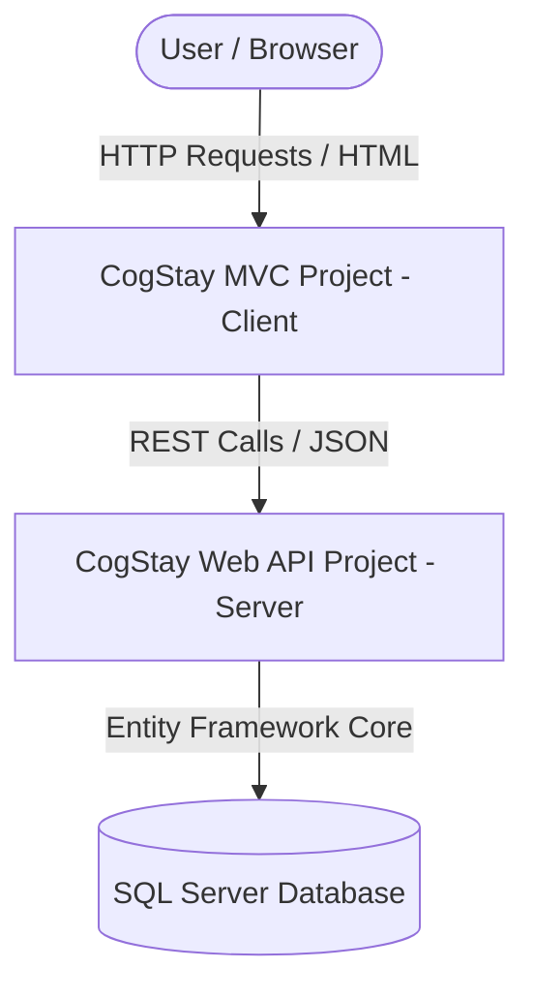
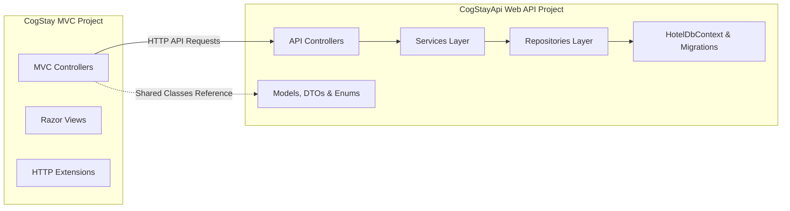

# Solution Architecture - CogStay Lodge Management System

This document describes the refactored architecture of the CogStay application, showing the separation of concerns between the user interface front-end (MVC) and the business logic/data access layer (Web API).

---

## 1. Overall Solution Architecture

The application is structured as a decoupled client-server architecture consisting of two distinct projects within a single solution:

1. **CogStay (ASP.NET Core MVC)**:
   - Acts as the presentation layer.
   - Responsible for rendering HTML views, styling, managing user sessions, and processing user input.
   - Communicates with the backend exclusively via standard HTTP REST endpoints.
   
2. **CogStayApi (ASP.NET Core Web API)**:
   - Acts as the business logic and data access layer.
   - Houses the Entity Framework Core database context, migrations, models, services, and repositories.
   - Provides stateless RESTful endpoints consumed by the MVC client and potentially other third-party integrations.

---

## 2. Project Responsibilities

| Responsibility | CogStay (MVC) | CogStayApi (Web API) |
| :--- | :---: | :---: |
| HTML Views & Layouts | **Yes** | No |
| CSS, JavaScript, Static Assets | **Yes** | No |
| User Session Handling (Auth) | **Yes** | No (Stateless) |
| Core Business Logic (Services) | No | **Yes** |
| Data Persistence (Repositories) | No | **Yes** |
| Database Context & Migrations | No | **Yes** |
| Routing | View Routing | Attribute API Routing |

---

## 3. MVC ↔ Web API Interaction

The MVC project communicates with the Web API project using `HttpClient` instances managed by `IHttpClientFactory` to ensure socket health. 

* **Base URL Configuration**: The Web API's base URL is read from MVC's `appsettings.json` under `"ApiSettings:BaseUrl"` to prevent hardcoding.
* **Serialization**: Communication payload is formatted as JSON.
* **Error Handling**: A set of helper methods in `ControllerExtensions.cs` intercept non-success status codes (e.g., `400 Bad Request`, `404 Not Found`) and extract the API error message, throwing standard exceptions that are handled by the MVC controller's catch blocks to display user-friendly validation feedback.

---

## 4. Dependency and Build Flow

* **Compilation Dependency**: The `CogStay` MVC project has a compile-time project reference to `CogStayApi`. This reference is restricted *strictly* to accessing shared classes: Models, DTOs, and Enums.
* **Runtime Dependency**: At runtime, `CogStay` has **no direct reference or DI registration** of the DbContext, services, or repositories. If the Web API is offline, the MVC project cannot retrieve or persist any data.
