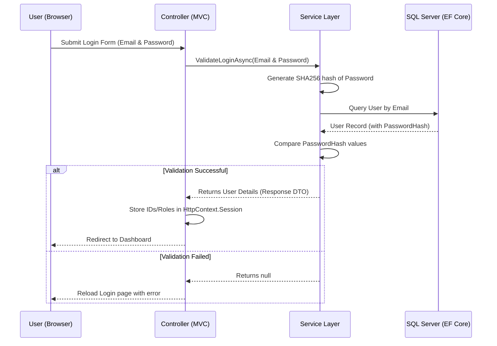

# Authentication & Authorization Documentation

This document explains the security architecture of the **CogStayMVC** application, focusing on how authentication (who the user is) and authorization (what the user is permitted to do) are implemented.

---

## 1. Overview of Security Design

Unlike typical enterprise applications that rely on ASP.NET Core Identity, Cookie Authentication Middleware, or JWT tokens, the **CogStayMVC** application utilizes a **Custom Session-Based State Validation** mechanism. 

- **State Storage**: Authentication state is stored in `HttpContext.Session` on the server, backed by an in-memory session cache.
- **Roles Checks**: Authorization checks are performed imperatively inside the controller action methods rather than declaratively using `[Authorize]` attributes.
- **Stateless APIs**: The API controllers (`Controllers/Api/`) do not use session state, providing stateless endpoints that receive direct inputs.

---

## 2. Authentication Flow

Authentication is split into two modules: **Guest/Customer Module** and **Staff Module**.



### A. Guest Authentication
- **Login Action**: Inside `GuestController.Login(GuestLoginDTO dto)`:
  - Calls `_guestService.ValidateGuestLoginAsync(dto)` which hashes the password using SHA256 and compares it with the database value.
  - Upon success, the controller registers the following session variables:
    ```csharp
    HttpContext.Session.SetInt32("GuestId", guest.GuestId);
    HttpContext.Session.SetString("GuestName", guest.FullName);
    HttpContext.Session.SetString("GuestEmail", guest.Email);
    ```

### B. Staff Authentication
- **Login Action**: Inside `StaffController.Login(StaffLoginDTO dto)`:
  - Calls `_staffService.ValidateStaffLoginAsync(dto)`.
  - Upon success, the controller registers the following session variables:
    ```csharp
    HttpContext.Session.SetInt32("StaffId", staff.StaffId);
    HttpContext.Session.SetString("StaffName", staff.FullName);
    HttpContext.Session.SetString("StaffRole", staff.Role.ToString());
    ```

---

## 3. Authorization Flow

Authorization in **CogStayMVC** is custom-written. The application defines staff roles using the `StaffRole` enumeration in `Enums/Enums.cs`:
- `Admin`
- `Manager`
- `FrontDesk`
- `Housekeeping`

### A. Role-Based View Customization
Views access the session values or the `ViewData["Role"]` bag passed by the controller to conditionally render components, forms, and navigation options.

### B. Action-Level Security Enforcement
Every action method that requires authentication/authorization manually checks session variables at the start of execution:

```csharp
[HttpGet]
public async Task<IActionResult> Index()
{
    // 1. Retrieve the authenticated role from the session
    string? staffRole = HttpContext.Session.GetString("StaffRole");

    // 2. Perform explicit role validation
    if (string.IsNullOrEmpty(staffRole) || (staffRole != "FrontDesk" && staffRole != "Manager"))
    {
        if (string.IsNullOrEmpty(staffRole)) 
            return RedirectToAction("Login", "Staff"); // Redirect to authentication gateway
        
        // Redirect to their default dashboard if authenticated but unauthorized
        return RedirectToAction("Dashboard", "Staff", new { role = staffRole }); 
    }

    // 3. Request is Authorized: proceed with execution...
    ViewData["Role"] = staffRole;
    var bills = await _billingService.GetAllBillsAsync();
    return View(bills);
}
```

### Role Mapping Matrix

| Controller | Permitted Roles / Sessions | Action If Access Denied |
| :--- | :--- | :--- |
| **GuestController** | `GuestId` must exist | Redirect to `Guest/Login` |
| **StaffController** | `StaffRole` must exist (Role-specific dashboards) | Redirect to `Staff/Login` |
| **RoomController** | `Admin`, `Manager` | Redirect to Login or Staff dashboard |
| **BillingController** | `FrontDesk`, `Manager` | Redirect to Login or Staff dashboard |
| **CheckInController** | `FrontDesk` | Redirect to Login or Staff dashboard |
| **HousekeepingController** | `Housekeeping`, `Manager` | Redirect to Login or Staff dashboard |
| **ReservationController** | `FrontDesk`, `Manager` | Redirect to Login or Staff dashboard |
| **FeedbackController** | **Index/Delete**: `Manager`<br>**Create**: `GuestId` | Redirect to Login or appropriate dashboard |

---

## 4. Key Security Best Practices and Implementation Details

1. **Password Hashing (SHA256)**: Passwords are hashed before database persistence or validation. The hash is deterministic:
   `SHA256(UTF8(password))`. No raw passwords are saved, mitigating password theft risks in the event of a database compromise.
2. **CSRF Prevention (Anti-Forgery Tokens)**: All MVC forms utilize ASP.NET Core's CSRF validation. Controllers decorate `POST` methods with `[ValidateAntiForgeryToken]` to verify browser-generated request headers against cookies.
3. **HTTP Cookie Security Configuration**: Session cookies are configured in [Program.cs](file:///c:/Users/Ritesh%20SK/Desktop/cogstay%209/CogStay---Project2/Program.cs) to block JavaScript access, preventing cross-site scripting (XSS) cookie hijacking:
   ```csharp
   builder.Services.AddSession(options =>
   {
       options.IdleTimeout = TimeSpan.FromMinutes(60);
       options.Cookie.HttpOnly = true;  // XSS protection
       options.Cookie.IsEssential = true;
   });
   ```
4. **Stateless API Design**: The REST API endpoints are designed to be stateless and currently bypass the session middleware. In future extensions, these API routes can be secured by registering standard JWT Token Authentication or API Key validation middleware in `Program.cs`.
