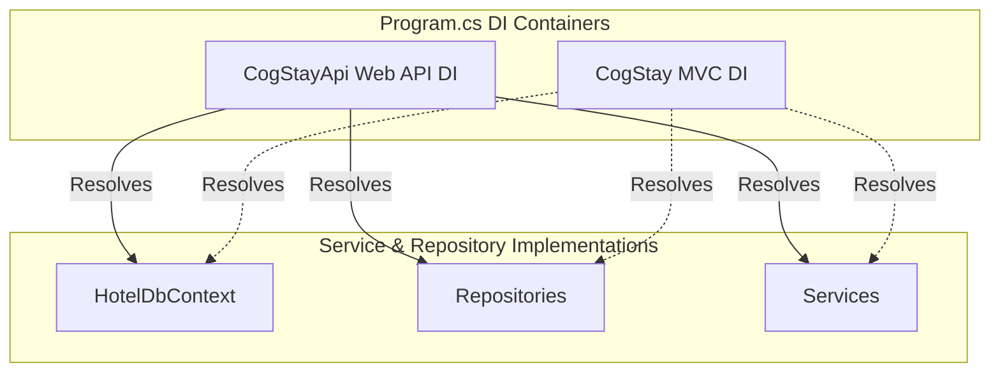

# Dependency Resolution and Registration Flow

This document details how dependencies are registered, structured, and resolved within the restructured CogStay solution.

---

## 1. Dependency Inversion and Injection Model

Both projects feature separate dependency injection (DI) registrations in their respective `Program.cs` files, drawing from the same underlying classes declared in the `CogStay` MVC project.



---

## 2. Dependency Resolution Flow by Layer

When a client makes a call to the API, dependencies are resolved down the stack as follows:

```text
[API Controller] ➔ [Service Interface] ➔ [Repository Interface] ➔ [HotelDbContext] ➔ [Database]
```

### Layer 1: API Controllers
- API controllers (e.g. `RoomApiController` inside `CogStayApi`) define their dependency on service interfaces (e.g. `IRoomService`).
- Resolved via constructor injection from the DI container.

### Layer 2: Services
- Service implementations (e.g. `RoomService` inside `CogStay`) implement business logic and validation.
- Services define their dependencies on repository interfaces (e.g. `IRoomRepository`).
- Resolved via constructor injection from the DI container.

### Layer 3: Repositories
- Repository implementations (e.g. `RoomRepository` inside `CogStay`) implement data access methods (SQL operations / LINQ queries).
- Repositories define their dependency on the database context `HotelDbContext`.
- Resolved via constructor injection from the DI container.

### Layer 4: Data Layer (`HotelDbContext`)
- Housed inside `CogStay/Data`.
- Relies on the configured DbContextOptions containing the connection string to execute commands against the database.

---

## 3. Registered Dependency Services Map

The following services are registered in the DI containers (`Program.cs` in both projects) with their corresponding lifetimes:

| Service / Repository Interface | Implementation Class | DI Lifetime |
| :--- | :--- | :--- |
| `HotelDbContext` | `HotelDbContext` | Scoped |
| `IGuestRepository` | `GuestRepository` | Scoped |
| `IRoomRepository` | `RoomRepository` | Scoped |
| `IReservationRepository` | `ReservationRepository` | Scoped |
| `IStayRecordRepository` | `StayRecordRepository` | Scoped |
| `IBillingRepository` | `BillingRepository` | Scoped |
| `IHousekeepingTaskRepository` | `HousekeepingTaskRepository` | Scoped |
| `IStaffRepository` | `StaffRepository` | Scoped |
| `IFeedbackRepository` | `FeedbackRepository` | Scoped |
| `IGuestService` | `GuestService` | Scoped |
| `IRoomService` | `RoomService` | Scoped |
| `IReservationService` | `ReservationService` | Scoped |
| `ICheckInService` | `CheckInService` | Scoped |
| `IBillingService` | `BillingService` | Scoped |
| `IHousekeepingService` | `HousekeepingService` | Scoped |
| `IStaffService` | `StaffService` | Scoped |
| `IFeedbackService` | `FeedbackService` | Scoped |
