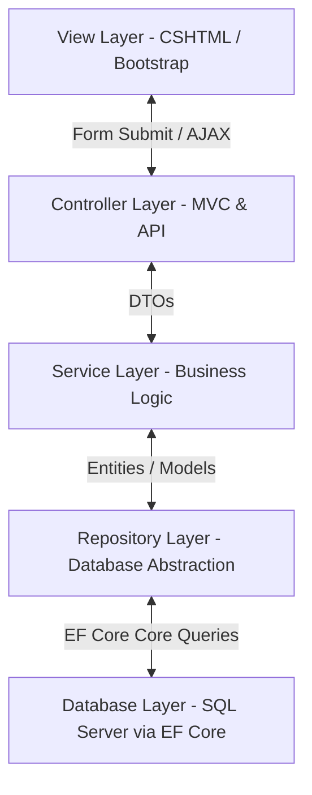

# Project Flow & Architecture Documentation

This document provides a comprehensive technical overview of the **CogStayMVC** application architecture, folder structure, and request execution pipelines. It is designed to help new developers quickly understand how data flows through the application and how various layers interact.

---

## 1. Project Architecture

The **CogStayMVC** application is built using the **N-Tier (Layered) Architecture** pattern based on **ASP.NET Core MVC (Model-View-Controller)**. The application separates concerns into logical, distinct layers:



### The Architectural Layers

1. **Presentation / View Layer (`Views/`)**: Responsible for rendering HTML/CSS to the user, accepting inputs, displaying error/success notifications (via `TempData`, `ViewData`, `ViewBag`), and handling form submissions.
2. **Controller Layer (`Controllers/`)**:
   - **MVC Controllers**: Handle browser requests, maintain session state, bind forms/route parameters to DTOs, call the service layer, and return rendered views or redirection results.
   - **API Controllers (`Controllers/Api/`)**: Provide stateless, RESTful API endpoints. They receive JSON payloads, perform model validation, call services, and return REST-compliant JSON responses with appropriate HTTP status codes.
3. **Business Logic / Service Layer (`Services/`)**: The bridge between Controllers and Repositories. It encapsulates domain-specific logic, maps DTOs to database models (and vice versa), hashes passwords, verifies room availability, enforces status flow transitions, and coordinates repository calls.
4. **Repository Layer (`Repositories/`)**: Abstracts direct database calls. It utilizes a generic repository pattern (`IRepository<T>` / `Repository<T>`) for standard CRUD operations and custom repositories for eager loading and query filters using Entity Framework Core.
5. **Database Layer (`Data/` & `Models/`)**: Comprises the EF Core DbContext (`HotelDbContext`), migrations, entity model definitions, and database constraints configuration.

---

## 2. Folder Structure Overview

```text
CogStay---Project2/
│
├── Controllers/            # MVC Controllers (handles browser interactions)
│   └── Api/                # REST API Controllers (exposes REST endpoints)
│
├── Services/               # Business Logic Layer
│   ├── Interfaces/         # Interface declarations (IServiceInterfaces.cs)
│   ├── Admin/              # Room and Staff business services
│   ├── FrontDesk/          # Check-in and Billing services
│   ├── Guest/              # Guest registration and booking history
│   ├── Housekeeping/       # Housekeeping task orchestration
│   └── Manager/            # Feedbacks management
│
├── Repositories/           # Data Access Layer (EF Core abstraction)
│   ├── Interfaces/         # Generic and Specific Repository Interfaces
│   ├── Implementations/    # Generic Repository implementation (Repository.cs)
│   ├── Admin/              # Room and Staff repositories
│   ├── FrontDesk/          # Reservation and stay repositories
│   ├── Housekeeping/       # Housekeeping task repository
│   └── Manager/            # Feedback repository
│
├── DTOs/                   # Data Transfer Objects (Request/Response contracts)
├── Models/                 # Domain Entity Models (Database Tables mapping)
├── Data/                   # DbContext (HotelDbContext.cs) and EF Core migrations
├── Views/                  # MVC Razor Views (.cshtml files)
├── wwwroot/                # Static assets (CSS, images, JavaScript)
├── Properties/             # Launch configurations (launchSettings.json)
├── Program.cs              # Application bootstrapper and DI configuration
└── CogStayMVC.csproj       # Project configuration file
```

---

## 3. The Complete Request Lifecycle

Whether a request originates from an HTML form in a browser or from a REST client (Postman/cURL), the request flows through the pipeline in a structured lifecycle.

### Request-Response Execution Pipeline

```text
[ Browser / REST Client ]
         │
         ▼
 1. Routing Middleware (Program.cs matches Route)
         │
         ▼
 2. Model Binding (Binds form/JSON fields to DTO params)
         │
         ▼
 3. Model Validation (Validates DataAnnotations attributes)
         │
         ├─► [Validation Fails] ──► Return 400 BadRequest / Return View with Errors
         │
         ▼
 4. Controller Action Execution (Invokes Service Layer)
         │
         ▼
 5. Service Layer (Processes Business Rules & maps DTO to Model)
         │
         ▼
 6. Repository Layer (Executes LINQ/EF Core queries)
         │
         ▼
 7. Database Operation (SQL Server returns raw database rows)
         │
         ▼
 8. Repository maps DB rows to Models/Entities and returns to Service
         │
         ▼
 9. Service Layer maps Models to Response DTOs and returns to Controller
         │
         ▼
10. Controller returns View (HTML) or JSON Response
         │
         ▼
[ User / Client gets Response ]
```

### Detailed Flow Explanation

1. **Routing**: The ASP.NET Core middleware matches the incoming request URL. MVC routes are conventional (mapped using `app.MapControllerRoute`), whereas API routes are attribute-based (mapped using `app.MapControllers`).
2. **Model Binding**: The system parses the URL parameters, query string variables, and request body (JSON or Form URL encoded) and populates them into the corresponding properties of the target DTO or parameter.
3. **Model Validation**: The built-in Model State validator evaluates Data Annotation attributes (like `[Required]`, `[StringLength]`, `[EmailAddress]`). If errors exist, `ModelState.IsValid` is marked as `false`.
4. **Controller Processing**: The controller extracts the validated DTO, inspects/manages session values (if MVC), and calls the designated asynchronous service method.
5. **Business Logic Execution**: The service processes business logic (e.g. checks room availability, validates password hashes using SHA256) and instantiates the domain model entity.
6. **Repository Execution**: The service passes the domain model to the repository. The repository translates the request into an EF Core method call.
7. **Database Querying**: EF Core translates the LINQ expressions/DBSet operations into SQL queries and executes them against the SQL Server database.
8. **Save Changes**: Write operations execute `await _context.SaveChangesAsync()` inside the repository, committing transactions.
9. **Return Mapping**: Database entities flow back up. The Service maps the database Entity back to a read-only Response DTO (e.g. `GuestResponseDTO` or `RoomResponseDTO`) to prevent exposing database internals.
10. **Result Action**: The controller receives the Response DTO and returns it as a view template (`View(model)`) or serializes it to a JSON API response (`Ok(model)`).

---

## 4. Key Cross-Cutting Concerns

### A. Dependency Injection (DI) Flow
ASP.NET Core uses a built-in Dependency Injection container. In [Program.cs](file:///c:/Users/Ritesh%20SK/Desktop/cogstay%209/CogStay---Project2/Program.cs), dependencies are registered using scoped lifecycles (`AddScoped`), meaning a new instance is created once per HTTP request.

- **Service Registration**: Services are bound to their interfaces:
  ```csharp
  builder.Services.AddScoped<IRoomService, RoomService>();
  ```
- **Repository Registration**: Repositories are bound to their database interfaces:
  ```csharp
  builder.Services.AddScoped<IRoomRepository, RoomRepository>();
  ```
- **Injection Pattern**: Controllers inject Services, and Services inject Repositories through their respective constructors.

### B. Validation Flow
1. **Definition**: Properties on DTOs are decorated with Validation Attributes:
   ```csharp
   [Required(ErrorMessage = "Room number is required.")]
   public string RoomNumber { get; set; } = null!;
   ```
2. **Trigger**: ASP.NET Core MVC validates incoming objects automatically during model binding.
3. **Handling in API Controllers**: API Controllers marked with `[ApiController]` automatically return `400 Bad Request` containing a validation error payload if `ModelState.IsValid` is false.
4. **Handling in MVC Controllers**: MVC Controllers manually check `if (!ModelState.IsValid)` and return the validation errors back to the Razor view so the user can see them (using `asp-validation-for` tags).

### C. Exception Handling Flow
- **MVC Actions**: Wrapped in `try-catch` blocks. Caught exceptions are converted into user-friendly validation errors (`ModelState.AddModelError`) or warnings in `TempData["Error"]`, and the controller returns the original input view so user input is preserved.
- **API Actions**: Wrapped in `try-catch` blocks. If database constraints or business logic operations fail, they throw specific exceptions (like `InvalidOperationException` or `KeyNotFoundException`). The API controller catches these and converts them into appropriate HTTP status responses (e.g., `Conflict()`, `NotFound()`, or `StatusCode(500, ...)`).
